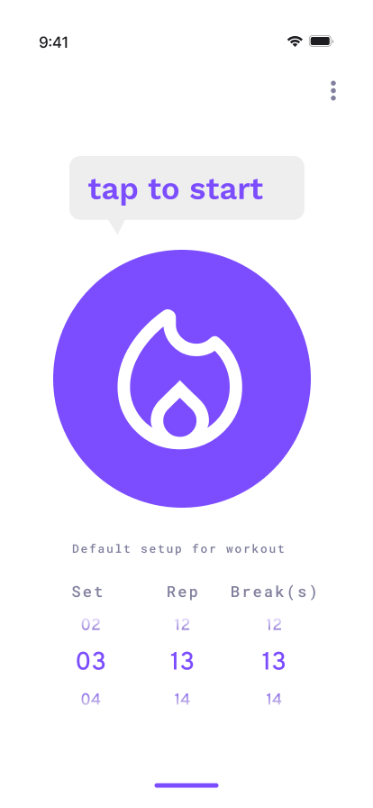
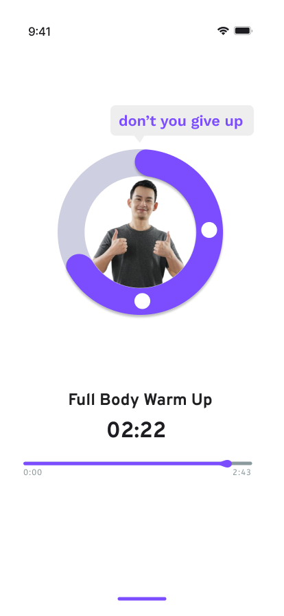
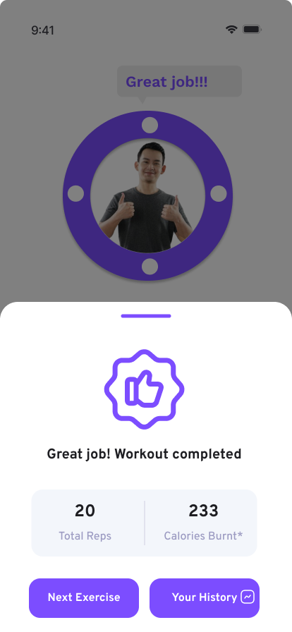

<p align="center">
  
</p>

<h1 align="center">Workout App</h1>

<p align="center">
  <strong>Your AI-powered personal fitness companion</strong>
</p>

<p align="center">
  
  
  
  
</p>

---

## About

Workout App is a guided fitness application with a virtual personal trainer experience. Choose your coach — **Alan** or **Lina** — and let them motivate you through every rep with voice encouragement, real-time progress tracking, and a clean, minimal interface.

The app focuses on a **guided workout flow**: no complicated menus, no overwhelming options — just start, sweat, and celebrate.

---

## Screenshots

<p align="center">
  
  
  
  
</p>

---

## Features

- **Virtual Personal Trainer** — Choose between Alan or Lina as your coach with unique voice lines
- **Motivational Speech Bubbles** — Real-time encouragement at 25%, 50%, 75% milestones
- **Circular Progress Ring** — Visual rep counter with animated progress
- **Customizable Workouts** — Set your own sets, reps, and break time using wheel pickers
- **Workout Timer** — Full countdown with horizontal progress bar
- **Completion Summary** — Total reps and estimated calories burned at the end
- **Settings Panel** — Trainer voice, rep pace, countdown delay, sound toggle
- **Progress Dashboard** — Track workout history with categories and exercise cards
- **Keep Awake** — Screen stays on during active workouts
- **Persistent Settings** — Preferences saved locally with AsyncStorage
- **Custom Fonts** — Overpass font family for a clean, modern look
- **Smooth Animations** — Animated logo, speech bubbles, and transitions

---

## Tech Stack

| Layer | Technology |
|---|---|
| **Framework** | React Native 0.74.1 |
| **Platform** | Expo SDK 51 |
| **Navigation** | React Navigation 6 (Stack) |
| **State Management** | React Context API |
| **Local Storage** | AsyncStorage |
| **Audio** | Expo AV |
| **Animations** | React Native Reanimated, Animated API |
| **SVG** | react-native-svg |
| **UI Components** | react-native-wheely (wheel picker) |
| **Fonts** | Expo Font (Overpass family) |
| **Screen Lock** | expo-keep-awake |

---

## Project Structure

```
workout_app/
├── App.js                    # Entry point, navigation setup
├── src/
│   ├── SettingsContext.js     # Global settings (trainer, time, sound)
│   ├── screens/
│   │   ├── IntroScreen.js    # Coach greeting & start
│   │   ├── MainScreen.js     # Home — tap to start workout
│   │   ├── WorkoutScreen.js  # Active workout with timer & progress
│   │   ├── SettingsScreen.js # Trainer, pace, sound preferences
│   │   └── ProgressScreen.js # Workout history & categories
│   ├── components/
│   │   ├── AnimatedBubble.js          # Speech bubble with animation
│   │   ├── CircularProgressBar.js     # Circular rep counter ring
│   │   ├── HorizontalProgressBar.js   # Timeline progress bar
│   │   ├── BottomSheet.js             # Workout complete modal
│   │   ├── BottomIndicatorBar.js      # Bottom navigation indicator
│   │   └── Progress.js               # Progress component
│   └── theme/
│       ├── index.js          # Theme export
│       ├── colors.js         # Color palette (#7C4DFF primary)
│       ├── fonts.js          # Font family definitions
│       └── spacing.js        # Spacing constants
└── assets/
    ├── fonts/                # Overpass font files
    ├── icon/                 # App icons
    ├── trainer-alan.png      # Alan avatar
    ├── trainer-lina.png      # Lina avatar
    └── logo.png              # App logo (flame icon)
```

---

## User Flow

```
Intro (Meet your coach)
 └─→ Main Screen (Configure sets/reps/break → Tap to start)
      └─→ Active Workout (Timer, rep counter, motivational quotes)
           └─→ Workout Complete (Stats summary)
                ├─→ Next Exercise (restart)
                └─→ Your History (progress dashboard)
```

---

## Getting Started

### Prerequisites

- Node.js >= 18
- Yarn
- Expo CLI
- iOS Simulator or Android Emulator (or physical device with Expo Go)

### Installation

```bash
# Clone the repository
git clone <repository-url>
cd workout_app

# Install dependencies
yarn install

# Start the development server
yarn start
```

### Running

```bash
# iOS
yarn ios

# Android
yarn android

# Web
yarn web
```

---

## Color Palette

| Color | Hex | Usage |
|---|---|---|
| Primary Purple | `#7C4DFF` | Buttons, accents, progress rings |
| Background | `#FFFFFF` | Main background |
| Secondary BG | `#F3F6FB` | Cards, secondary surfaces |
| Text Primary | `#000000` | Headings |
| Text Secondary | `#81809E` | Labels, descriptions |
| Border | `#CFCFE2` | Input borders, dividers |

---

## License

This project is private and not licensed for public distribution.
